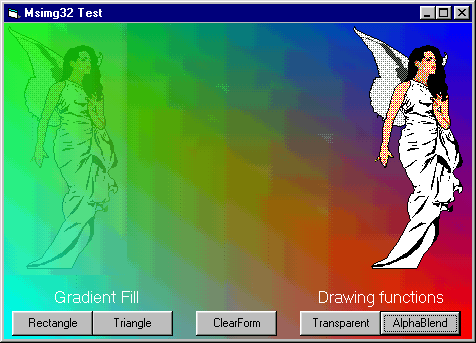



## Make hard graphics easy\!

### Description

Make your graphic work easy with msimg32.dll. This dll shipped with w98/2000. Include functions for Transparent blitting, AlphaBlending and Gradient Filling. Easy to code, but great effect. See screenshot!!!
 
### More Info
 
Works only with w98/2000

             |
---                |---
**Submitted On**   |2000-08-03 20:49:40
**By**             |[Ark](https://github.com/Planet-Source-Code/PSCIndex/blob/master/ByAuthor/ark.md)
**Level**          |Advanced
**User Rating**    |4.6 (51 globes from 11 users)
**Compatibility**  |VB 4\.0 \(32\-bit\), VB 5\.0, VB 6\.0
**Category**       |[Graphics](https://github.com/Planet-Source-Code/PSCIndex/blob/master/ByCategory/graphics__1-46.md)
**World**          |[Visual Basic](https://github.com/Planet-Source-Code/PSCIndex/blob/master/ByWorld/visual-basic.md)
**Archive File**   |[CODE\_UPLOAD8543832000\.zip](https://github.com/Planet-Source-Code/ark-make-hard-graphics-easy__1-10342/archive/master.zip)

